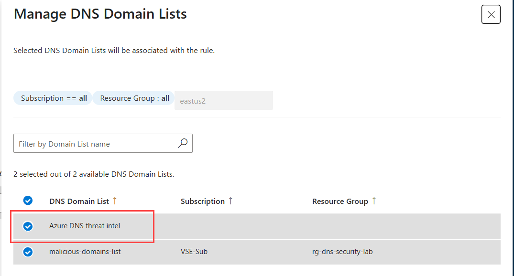
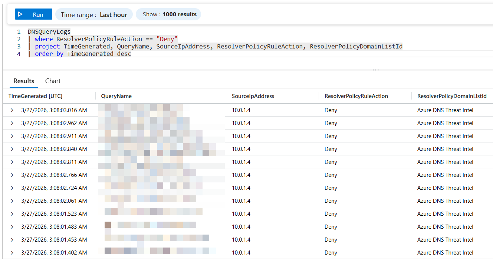

# Azure DNS Security Policy Lab

A complete lab environment for testing and learning Azure DNS Security Policies with comprehensive monitoring capabilities. This lab demonstrates how to deploy and configure DNS security policies to block malicious domains using Azure CLI automation in GitHub Codespaces.

## 🙏 Credits

This repository is a fork of the original lab created by **[@samsmith-MSFT](https://github.com/samsmith-MSFT)**:

> **[samsmith-MSFT/AzDnsSecurityPolicyLab](https://github.com/samsmith-MSFT/AzDnsSecurityPolicyLab)**

The original lab environment and all core concepts, architecture, scripts, and documentation were authored by samsmith-MSFT. This fork converts the deployment from Azure CLI scripts to a Bicep-based infrastructure-as-code approach.

The **Sentinel integration** (Scenario 5) — including Summary Rules, Analytics Rules, and Threat Intelligence detection — is based on the excellent blog post by **[@pisinger (Pit Singert)](https://github.com/pisinger)**:

> **[Detect suspicious DNS requests using Azure DNS Security Policy and Sentinel Summary Rules](https://pisinger.github.io/posts/detect-suspicious-dns-requests/)**

## 🎯 Lab Overview

This lab creates a complete Azure environment with:

- **Virtual Network** with an Ubuntu 22.04 LTS virtual machine (no public IP)
- **Azure Bastion (Developer SKU)** for secure browser-based SSH access — no public IP or dedicated subnet required
- **Azure Key Vault** storing an auto-generated VM password (no manual password entry)
- **Azure DNS Security Policy** linked to the virtual network
- **DNS Domain List** with malicious domains (`malicious.contoso.com.`, `exploit.adatum.com.`)
- **DNS Security Rules** to block specific domains with blockpolicy.azuredns.invalid response
- **Network Security Group** for internal access only
- **Log Analytics Workspace** for DNS query monitoring and diagnostics
- **Microsoft Sentinel** enabled on the workspace for threat detection and analytics
- **Diagnostic Settings** configured to capture all DNS security events

## 🏗️ Architecture

```
┌─────────────────────────────────────────────────────────────┐
│                    Azure Subscription                       │
│                                                             │
│  ┌─────────────────────────────────────────────────────┐    │
│  │                Resource Group                       │    │
│  │                                                     │    │
│  │  ┌─────────────────┐    ┌─────────────────────────┐ │    │
│  │  │  Virtual Network│    │   DNS Security Policy   │ │    │
│  │  │  (10.0.0.0/16)  │◄───┤  - Domain List          │ │    │
│  │  │                 │    │  - Security Rules       │ │    │
│  │  │  ┌─────────────┐│    │  - VNet Link            │ │    │
│  │  │  │   Subnet    ││    │  - Diagnostic Settings  │ │    │
│  │  │  │(10.0.1.0/24)││    └─────────────┬───────────┘ │    │
│  │  │  │             ││                  │             │    │
│  │  │  │  ┌────────┐ ││    ┌─────────────┼───────────┐ │    │
│  │  │  │  │Ubuntu  │ ││    │     NSG     │           │ │    │
│  │  │  │  │VM      │◄┼┼────┤  - No Public IP         │ │    │
│  │  │  │  └───┬────┘ ││    └─────────────┘           │ │    │
│  │  │  └──────┼──────┘│                              │ │    │
│  │  └─────────┼───────┘                              │ │    │
│  │            │ ▲ Browser SSH                        │ │    │
│  │  ┌─────────┴─┴──────────────────────────────────┐ │ │    │
│  │  │  Azure Bastion (Developer SKU)               │ │ │    │
│  │  │  - No dedicated subnet or public IP needed   │ │ │    │
│  │  └──────────────────────────────────────────────┘ │ │    │
│  │                                                   │ │    │
│  │  ┌─────────────────────────────────────────────┐  │ │    │
│  │  │  Azure Key Vault                            │  │ │    │
│  │  │  - Auto-generated VM password               │  │ │    │
│  │  │  - Access policy scoped to deploying user   │  │ │    │
│  │  └─────────────────────────────────────────────┘  │ │    │
│  │                                                   │ │    │
│  │  ┌───────────────────────────────────────────────┘ │    │
│  │  │           Log Analytics Workspace                │    │
│  │  │           - DNS Query Logs                       │    │
│  │  │           - Diagnostic Data                      │    │
│  │  └──────────────────────────────────────────────────┘    │
│  └─────────────────────────────────────────────────────┘    │
└─────────────────────────────────────────────────────────────┘
```

## 📋 Prerequisites

**✅ NONE!** This lab is designed to run in GitHub Codespaces with no additional setup required.

The Codespaces devcontainer includes:
- Azure CLI (latest version)
- jq JSON processor
- All required VS Code extensions

## 🚀 Quick Start

### 1. Open in Codespaces (or clone locally)

Click the **"Code"** button and select **"Open with Codespaces"**, or clone the repository and open in VS Code.

### 2. Configure Your Settings (Optional)

`answers.json` only contains the resource group name — no subscription ID required:

```json
{
  "resourceGroupName": "rg-dns-security-lab"
}
```

The deployment scripts will prompt you to pick a subscription interactively after login. Resource naming and location are configured in [`infra/main.bicepparam`](infra/main.bicepparam). Edit that file if you want to customise names or the default `eastus2` region.

### 3. Deploy the Lab

**Linux / Codespaces (Bash):**
```bash
./scripts/deploy-lab.sh
```
> If you get "Permission denied", run `chmod +x scripts/*.sh` first.

**Windows (PowerShell):**
```powershell
.\scripts\deploy-lab.ps1
```
> Requires the `Az.Resources` PowerShell module (`Install-Module Az.Resources`). The script will install it automatically if missing.

Both scripts will:
- Prompt for Azure authentication via device code
- Show a numbered list of your subscriptions — pick one
- Auto-generate a random VM password and store it in Key Vault (no password prompt)
- Create the resource group
- Deploy `infra/main.bicep` as a single ARM deployment
- Print a deployment summary including the Key Vault name and how to retrieve the password

### 4. Retrieve VM Password and Connect via Bastion

The VM password was auto-generated and stored in Key Vault. Retrieve it with:

**PowerShell:**
```powershell
Get-AzKeyVaultSecret -VaultName '<kv-name-from-output>' -Name 'vm-admin-password' -AsPlainText
```

**Bash / Codespaces:**
```bash
az keyvault secret show --vault-name '<kv-name-from-output>' --name 'vm-admin-password' --query value -o tsv
```

Then connect to the VM:

1. Go to [Azure Portal](https://portal.azure.com)
2. Navigate to **Virtual Machines** and select your VM
3. Click **Connect → Connect via Bastion**
4. Set **Authentication Type** to **"Password"**
   > **Do NOT** select "Password from Azure Key Vault" — that feature requires Bastion Basic/Standard SKU (~$139/month). Developer SKU is free; just paste the password manually.
5. Enter username `azureuser`
6. Paste the password you retrieved from Key Vault above

### 5. Test DNS Blocking

From the Bastion browser terminal:
```bash
# Test blocked domains (should return blockpolicy.azuredns.invalid)
dig malicious.contoso.com
dig exploit.adatum.com

# Test allowed domains (should resolve normally)
dig google.com
dig microsoft.com

# For more detailed output, use:
dig malicious.contoso.com +short
dig @8.8.8.8 google.com  # Test with external DNS for comparison
```

**Expected Results:**
- **Blocked domains**: Should return `blockpolicy.azuredns.invalid`
- **Allowed domains**: Should return IP addresses normally

### 6. Monitor DNS Activity

View DNS logs in Log Analytics:
1. Go to your resource group in Azure Portal
2. Open the Log Analytics workspace (`law-dns-security-lab`)
3. Click "Logs" and run KQL queries

### 7. Clean Up

**Linux / Codespaces:**
```bash
./scripts/remove-lab.sh
```

**Windows (PowerShell):**
```powershell
.\scripts\remove-lab.ps1
```

## 🏗️ Infrastructure as Code

All Azure resources are defined in [`infra/main.bicep`](infra/main.bicep) and deployed as a single ARM deployment. The parameters file [`infra/main.bicepparam`](infra/main.bicepparam) contains all resource naming defaults.

| File | Purpose |
|------|---------|
| `infra/main.bicep` | Bicep template — all resource definitions |
| `infra/main.bicepparam` | Parameter values (names, location, SKUs) |
| `answers.json` | Resource group name (no subscription ID needed) |
| `scripts/deploy-lab.sh` | Bash deployment wrapper (Azure CLI) |
| `scripts/deploy-lab.ps1` | PowerShell deployment wrapper (Az module) |
| `scripts/remove-lab.sh` | Bash cleanup script |
| `scripts/remove-lab.ps1` | PowerShell cleanup script |

To deploy directly with Azure CLI (no script):
```bash
ADMIN_OID=$(az ad signed-in-user show --query id -o tsv)
az group create --name rg-dns-security-lab --location eastus2
az deployment group create \
  --resource-group rg-dns-security-lab \
  --template-file infra/main.bicep \
  --parameters infra/main.bicepparam \
  --parameters "keyVaultAdminObjectId=$ADMIN_OID"
```

The VM password is auto-generated and stored in Key Vault. Retrieve it after deployment:
```bash
KV=$(az deployment group show -g rg-dns-security-lab -n main --query properties.outputs.keyVaultName.value -o tsv)
az keyvault secret show --vault-name "$KV" --name vm-admin-password --query value -o tsv
```


## 📊 DNS Query Monitoring

The lab includes a Log Analytics workspace that automatically collects DNS query logs from the DNS Security Policy. This provides visibility into:

- **All DNS queries** passing through the security policy
- **Blocked queries** and the domains that triggered blocks
- **Query patterns** and frequency analysis
- **Security events** for monitoring malicious activity

### Accessing DNS Logs

1. Navigate to your DNS security policy in the Azure Portal
2. Under **Monitoring**, select **Diagnostic settings**
3. Select your Log Analytics workspace (`law-dns-security-lab`)
4. Click **Logs** to open the query interface

### Sample KQL Queries

Based on the official [DNSQueryLogs table schema](https://learn.microsoft.com/en-us/azure/azure-monitor/reference/tables/dnsquerylogs), here are accurate queries for analyzing DNS security events:

```kusto
// View all DNS queries from the last hour
DNSQueryLogs
| where TimeGenerated > ago(1h)
| project TimeGenerated, QueryName, SourceIpAddress, ResponseCode, ResolverPolicyRuleAction
| order by TimeGenerated desc

// View blocked DNS queries only
DNSQueryLogs
| where ResolverPolicyRuleAction == "Deny"
| project TimeGenerated, QueryName, SourceIpAddress, ResolverPolicyRuleAction, ResolverPolicyDomainListId
| order by TimeGenerated desc

// Count queries by domain name
DNSQueryLogs
| summarize QueryCount = count() by QueryName
| order by QueryCount desc

// Analyze query patterns by source IP and policy action
DNSQueryLogs
| summarize AllowedQueries = countif(ResolverPolicyRuleAction == "Allow"),
            BlockedQueries = countif(ResolverPolicyRuleAction == "Deny"),
            NoMatchQueries = countif(ResolverPolicyRuleAction == "NoMatch")
            by SourceIpAddress
| order by BlockedQueries desc

// View queries from specific virtual network
DNSQueryLogs
| where VirtualNetworkId contains "vnet-dns-security-lab"
| project TimeGenerated, QueryName, SourceIpAddress, QueryType, ResponseCode
| limit 100

// DNS query analysis by hour with policy actions
DNSQueryLogs
| summarize AllowedCount = countif(ResolverPolicyRuleAction == "Allow"),
            BlockedCount = countif(ResolverPolicyRuleAction == "Deny"),
            NoMatchCount = countif(ResolverPolicyRuleAction == "NoMatch")
            by bin(TimeGenerated, 1h)
| order by TimeGenerated desc

// Security-focused query: Show all blocked malicious domains
DNSQueryLogs
| where ResolverPolicyRuleAction == "Deny"
| where QueryName contains "malicious" or QueryName contains "exploit"
| project TimeGenerated, QueryName, SourceIpAddress, ResponseCode
| order by TimeGenerated desc
```

### Understanding DNS Response Codes

- **0**: NOERROR (successful query)
- **3**: NXDOMAIN (domain does not exist)

### Key DNSQueryLogs Table Fields

- `TimeGenerated`: Timestamp when the log was created
- `QueryName`: Domain being queried (e.g., "malicious.contoso.com")
- `SourceIpAddress`: IP address that made the DNS query
- `ResolverPolicyRuleAction`: Policy action taken ("Allow", "Deny", "Alert", "NoMatch") - use this to identify blocked queries
- `ResolverPolicyId`: ID of the security policy that processed the query
- `VirtualNetworkId`: ID of the virtual network where query originated

## � Advanced DNS Log Analysis

### Monitoring DNS Security Events

The DNS security policy automatically generates diagnostic logs for all DNS queries processed. These logs are essential for:

- **Security monitoring**: Tracking blocked malicious domains
- **Traffic analysis**: Understanding DNS query patterns
- **Compliance**: Maintaining audit trails of DNS filtering actions
- **Troubleshooting**: Diagnosing DNS resolution issues

### Real-time Monitoring Setup

1. **Immediate Analysis**: Logs typically appear within 1-2 minutes
2. **Retention**: Default Log Analytics retention (30-730 days configurable)
3. **Alerting**: Create custom alerts based on blocked query thresholds
4. **Dashboards**: Build visual dashboards for DNS security insights

### Advanced Query Examples

```kusto
// Security Alert: High volume of blocked queries from single source
DNSQueryLogs
| where TimeGenerated > ago(1h)
| where ResolverPolicyRuleAction == "Deny"
| summarize BlockedCount = count() by SourceIpAddress
| where BlockedCount > 10
| order by BlockedCount desc

// Trend Analysis: DNS query volume over time
DNSQueryLogs
| where TimeGenerated > ago(24h)
| summarize TotalQueries = count(),
            BlockedQueries = countif(ResolverPolicyRuleAction == "Deny"),
            AllowedQueries = countif(ResolverPolicyRuleAction == "Allow"),
            NoMatchQueries = countif(ResolverPolicyRuleAction == "NoMatch")
            by bin(TimeGenerated, 1h)
| extend BlockedPercentage = round((BlockedQueries * 100.0) / TotalQueries, 2)
| project TimeGenerated, TotalQueries, BlockedQueries, AllowedQueries, NoMatchQueries, BlockedPercentage

// Forensic Analysis: Detailed view of specific domain queries
DNSQueryLogs
| where QueryName contains "malicious.contoso.com"
| project TimeGenerated, SourceIpAddress, QueryType, ResponseCode, 
          ResolverPolicyRuleAction, QueryResponseTime
| order by TimeGenerated desc

// Performance Monitoring: Query response times
DNSQueryLogs
| where TimeGenerated > ago(1h)
| summarize AvgResponseTime = avg(QueryResponseTime),
            MaxResponseTime = max(QueryResponseTime),
            QueryCount = count()
            by ResolverPolicyRuleAction
| order by AvgResponseTime desc
```

### Creating Custom Alerts

Set up proactive monitoring with Azure Monitor alerts:

```kusto
// Alert query: Detect potential DNS tunneling attempts
DNSQueryLogs
| where TimeGenerated > ago(5m)
| where ResolverPolicyRuleAction == "Deny"
| summarize BlockedCount = count() by SourceIpAddress
| where BlockedCount > 5
```

**Alert Configuration:**
- **Frequency**: Every 5 minutes
- **Threshold**: More than 5 blocked queries from single IP
- **Action**: Email notification or webhook

### Export and Integration

- **Power BI**: Connect Log Analytics for advanced visualizations
- **Azure Sentinel**: Integrate for security information and event management (SIEM)
- **REST API**: Programmatic access to DNS logs
- **Export**: Regular data export to storage accounts

## �🔧 Detailed Configuration

### DNS Security Policy Details

The lab creates a DNS security policy with the following configuration:

- **Policy Name**: `dns-security-policy-lab`
- **Action**: Block
- **Response Code**: blockpolicy.azuredns.invalid
- **Priority**: 100
- **State**: Enabled
- **Blocked Domains**:
  - `malicious.contoso.com.` (note the trailing dot)
  - `exploit.adatum.com.` (note the trailing dot)

### Network Configuration

- **Virtual Network**: `vnet-dns-lab` (10.0.0.0/16)
- **Subnet**: `subnet-vm` (10.0.1.0/24)
- **VM**: Ubuntu 22.04 LTS, Standard_B1s, no public IP
- **Access**: Azure Bastion Developer (browser-based SSH)

### Monitoring Configuration

- **Log Analytics Workspace**: `law-dns-security-lab`
- **Diagnostic Settings**: Configured to capture DNS query logs
- **Data Retention**: Default Log Analytics retention policy

## 📊 Lab Scenarios

### Scenario 1: Basic DNS Blocking Test

1. Deploy the lab environment
2. Retrieve the VM password from Key Vault (see [Quick Start step 4](#4-retrieve-vm-password-and-connect-via-bastion))
3. Connect to the VM via **Azure Bastion** (Connect → Connect via Bastion in the Portal)
4. Test DNS blocking with these commands:

```bash
# Test blocked domains (should return blockpolicy.azuredns.invalid)
dig malicious.contoso.com
# Expected: blockpolicy.azuredns.invalid

dig exploit.adatum.com
# Expected: blockpolicy.azuredns.invalid

# Test allowed domains (should resolve normally)
dig google.com
# Expected: status: NOERROR, IP address returned

# Verbose testing for detailed output
dig malicious.contoso.com +short
# Expected: No output (blocked)

dig google.com +short
# Expected: IP address like 142.250.191.14
```

4. Verify results in Log Analytics (queries appear within 1-2 minutes)

### Scenario 2: DNS Policy Modification

1. Add new domains to the block list
2. Create additional security rules
3. Test different response codes
4. Modify rule priorities

### Scenario 3: Monitoring and Analysis

1. **Log Analytics Integration**: The lab automatically configures diagnostic settings to send DNS query logs to Log Analytics
2. **Monitor DNS Queries**: View all DNS queries and blocked attempts in the Log Analytics workspace
3. **Analyze Security Events**: Use KQL queries to analyze blocked vs. allowed queries
4. **Set Up Alerts**: Configure Azure Monitor alerts for suspicious DNS activity patterns

### Scenario 4: DNS Threat Intelligence Testing

This scenario enables **Azure DNS Threat Intelligence** on your DNS Security Policy and runs a bulk DNS test against a community-maintained blacklist of known malicious domains. It shows how Azure DNS blocks threat-intel-flagged domains and how to inspect the results in Log Analytics.

#### Step 1 — Enable DNS Threat Intelligence

In the Azure Portal:

1. Navigate to your **DNS Security Policy** (`dns-security-policy-lab`)
2. Under **Settings**, select **DNS Security Rule**
3. Enable **Threat Intelligence** and set the action to **Block** (or **Alert** if you only want logging)
4. Click **Save**

The configuration should look like this:



#### Step 2 — Download and run the DNS test script

Connect to the VM via Bastion (see [Quick Start step 4](#4-retrieve-vm-password-and-connect-via-bastion)), then run:

```bash
# Download the test script
curl -L https://raw.githubusercontent.com/dmauser/AzDnsSecurityPolicyLab/refs/heads/main/scripts/dnstest.sh -o dnstest.sh
chmod +x dnstest.sh

# Run against the full blacklist
./dnstest.sh

# Or filter by keyword (e.g. only domains containing "malware")
./dnstest.sh -q malware
```

**What the script does:**

The `dnstest.sh` script is a DNS security testing utility. It downloads a public blacklist of known malicious/suspicious domains from [fabriziosalmi/blacklists](https://github.com/fabriziosalmi/blacklists) and performs a `dig` (DNS lookup) against each domain. This generates a large volume of DNS queries that the Azure DNS Security Policy and Threat Intelligence engine will evaluate. The script:

- Installs `dig` automatically if it is not present on the VM
- Logs every query result with a timestamp to a log file (`dnstest_<timestamp>.log`)
- Supports an optional `-q <keyword>` filter to test only domains matching a keyword
- Prints results to both the console and the log file for later review

Domains flagged by Azure Threat Intelligence will be blocked or alerted depending on your policy configuration. Domains not flagged will resolve normally.

> **⚠️ Disclaimer:** The `dnstest.sh` script queries a large number of domains from a third-party blacklist. While the script only performs DNS lookups (it does not visit or download content from those domains), use it at your own risk and only in isolated lab/test environments. The blacklist content is maintained by a third party and may change without notice. Do not run this script against production DNS infrastructure.

#### Step 3 — Review results in Log Analytics

After running the script, wait 2-5 minutes for logs to appear in the Log Analytics workspace. Navigate to **Log Analytics** → **Logs** and run:

```kusto
// Threat Intelligence blocked queries
DNSQueryLogs
| where TimeGenerated > ago(1h)
| where ResolverPolicyRuleAction in ("Deny", "Alert")
| summarize BlockedCount = count() by QueryName
| order by BlockedCount desc
| take 50
```

You should see results similar to this:



The log entries show which domains were blocked by Threat Intelligence versus those blocked by your custom DNS Security Rules.

### Scenario 5: Sentinel DNS Threat Detection

This scenario builds on the DNS logging already in place and uses **Microsoft Sentinel** (automatically deployed with the lab) to detect suspicious DNS queries by correlating them against Threat Intelligence indicators. The approach follows the guide by [Pit Singert (@pisinger)](https://pisinger.github.io/posts/detect-suspicious-dns-requests/).

#### Step 1 — Verify Sentinel is enabled

Sentinel is deployed automatically with the lab (via the `SecurityInsights` solution on the Log Analytics workspace). Verify it in the Azure Portal:

1. Navigate to **Microsoft Sentinel**
2. You should see your workspace (`law-dns-security-lab`) listed
3. Click on it to open the Sentinel dashboard

#### Step 2 — Enable the Threat Intelligence data connector

1. In Sentinel, go to **Data connectors**
2. Search for **Microsoft Defender Threat Intelligence**
3. Click **Open connector page** and enable it

This populates the `ThreatIntelIndicators` table with known malicious domains and IPs.

#### Step 3 — Create a Summary Rule (cost optimization)

Summary Rules aggregate the high-volume `DNSQueryLogs` table into a smaller `DNSQueryLogs_sum_CL` custom table, reducing data volume by 80-90% while preserving detection capability.

1. In Sentinel, go to **Summary Rules** → **Create**
2. Set the aggregation interval to **1 hour**
3. Set the destination table to `DNSQueryLogs_sum_CL`
4. Paste this KQL query:

```kusto
DNSQueryLogs
| extend Answer = iif(Answer == "[]", '["NXDOMAIN"]', Answer)
| extend Answer = todynamic(Answer)
| mv-expand Answer
| extend parsed = parse_json(Answer)
| extend RData = parsed.RData
| extend RType = tostring(parsed.Type)
| extend QueryName = tolower(trim_end("\\.", QueryName))
| summarize EventCount = count(), Answers = make_set(tostring(RData))
    by bin(TimeGenerated, 1h), RType, OperationName, Region, VirtualNetworkId,
       SourceIpAddress, Transport, QueryName, QueryType, ResponseCode,
       ResolutionPath, ResolverPolicyRuleAction
| extend RDataCount = array_length(Answers)
```

> **Cost tip:** After creating the Summary Rule, you can switch the `DNSQueryLogs` table to **Basic** tier to further reduce costs:
> ```bash
> az monitor log-analytics workspace table update \
>   --resource-group rg-dns-security-lab \
>   --workspace-name law-dns-security-lab \
>   --name DNSQueryLogs --plan Basic
> ```

#### Step 4 — Create the Analytics (Detection) Rule

You can deploy the detection rule manually or use the one-click ARM template:

**Option A — Deploy via Azure Portal (one-click):**

[](https://portal.azure.com/#create/Microsoft.Template/uri/https%3A%2F%2Fraw.githubusercontent.com%2Fpisinger%2Fhunting%2Frefs%2Fheads%2Fmain%2Fsentinel-suspicious-dns-requests.json)

**Option B — Create manually:**

1. In Sentinel, go to **Analytics** → **Create** → **Scheduled query rule**
2. Set frequency to **1 hour** (matching the Summary Rule interval)
3. Set lookup period to **14 days**
4. Paste this KQL query:

```kusto
let dt_lookBack = 1h;
let ioc_lookBack = 14d;
let ThreatIntel = materialize(
    ThreatIntelIndicators
    | where TimeGenerated >= ago(ioc_lookBack) and ValidUntil > now()
    | where IsActive == true
    | summarize LatestIndicatorTime = arg_max(TimeGenerated, *) by Id
    | extend source = Data.name
    | extend IndicatorType = tostring(Data.indicator_types)
    | where ObservableKey has "domain"
    | extend DomainName = ObservableValue
    | where isnotempty(DomainName)
);
let DNSQueryLogs_sum = (
    DNSQueryLogs_sum_CL
    | where TimeGenerated >= ago(dt_lookBack)
    | extend QueryName = trim_end("\\.", QueryName)
);
// Exact domain match
let ioc_query_match_exact = (
    ThreatIntel
    | project DomainName, IsActive, Confidence, ValidUntil, IndicatorType
    | join kind=inner (DNSQueryLogs_sum | extend _LookupType = "query_match_exact")
      on $left.DomainName == $right.QueryName
);
// Parent domain match (e.g. sub.evil.com matches evil.com indicator)
let ioc_query_match_parentdomain_only = (
    ThreatIntel
    | project DomainName, IsActive, Confidence, ValidUntil, IndicatorType
    | join kind=inner (
        DNSQueryLogs_sum
        | extend DomainNameExtractKey = replace_regex(QueryName, "^.*?\\.", "")
        | extend _LookupType = "query_match_parentdomain_only"
    ) on $left.DomainName == $right.DomainNameExtractKey
);
// CNAME answer match
let ioc_answer_match_exact = (
    ThreatIntel
    | project DomainName, IsActive, Confidence, ValidUntil, IndicatorType
    | join kind=inner (
        DNSQueryLogs_sum
        | where RType == "CNAME"
        | mv-expand AnswersKey = Answers to typeof(string)
        | extend AnswersKey = trim_end("\\.", AnswersKey)
        | extend _LookupType = "answer_match_exact"
    ) on $left.DomainName == $right.AnswersKey
);
ioc_query_match_parentdomain_only
| union ioc_query_match_exact, ioc_answer_match_exact
| project TimeGenerated, QueryName, DomainName, IsActive, Confidence, ValidUntil,
         IndicatorType, RType, OperationName, SourceIpAddress, Transport, Answers,
         RDataCount, EventCount, Region, VirtualNetworkId, _LookupType
```

#### Step 5 — Test the detection

From the VM (via Bastion), resolve a domain that appears in the Threat Intelligence indicators:

```bash
# Find domains in Threat Intel (run in Sentinel Logs first):
# ThreatIntelIndicators | where ObservableKey has "domain" | project ObservableValue | take 20

# Then resolve one from the VM:
nslookup <domain-from-threat-intel>
```

After the Summary Rule aggregation interval (1 hour), the Analytics Rule should fire and create a Sentinel **Incident** showing the match.

#### Step 6 — (Optional) Additional rule: detect suspicious IPs from DNS answers

You may also want to detect DNS queries where the **resolved IP address** (A/AAAA answer) matches a known malicious IP from Threat Intelligence. This catches cases where the domain name itself isn't flagged but the IP behind it is.

Create a second Analytics Rule in Sentinel with this KQL:

```kusto
let dt_lookBack = 1h;
let ioc_lookBack = 14d;
ThreatIntelIndicators
| where TimeGenerated >= ago(ioc_lookBack) and ValidUntil > now()
| where IsActive == true
| summarize LatestIndicatorTime = arg_max(TimeGenerated, *) by Id
| extend IndicatorType = tostring(Data.indicator_types)
| where ObservableKey has "network-traffic"
| extend IpAddr = ObservableValue
| where isnotempty(IpAddr)
| project IpAddr, IsActive, Confidence, ValidUntil, IndicatorType
| join kind=inner (
    DNSQueryLogs_sum_CL
    | where TimeGenerated >= ago(dt_lookBack)
    | where RType in ("A","AAAA")
    | mv-expand Answers to typeof(string)
    | distinct QueryName, RType, Answers
) on $left.IpAddr == $right.Answers
```

> **Note:** This rule uses the `DNSQueryLogs_sum_CL` summary table. If you prefer to query the raw `DNSQueryLogs` table directly instead, keep it in **Analytics** tier (not Basic) because `join` operations are not supported on Basic-tier tables.

#### Cost considerations

| Component | Cost |
|---|---|
| Sentinel (first 31 days) | **Free** (10 GB/day) |
| Sentinel (after trial, light lab use ~100 MB/day) | ~$7-10/mo |
| DNSQueryLogs in Basic tier | ~$0.50/GB (vs $2.76 analytics tier) |
| Summary Rules output | ~$2.76/GB but 80-90% smaller volume |
| Threat Intel connector | **Free** |
| Analytics rules | **Free** (included in Sentinel) |

> For a lab running occasionally, expect **~$0 during the free trial** and **~$9-15/month** after, depending on DNS query volume.

## 🛠️ Alternative Scripts

### Environment Validation

Before deployment, you can validate your environment:

```bash
./scripts/validate-environment.sh
```

This checks for:
- Azure CLI installation and authentication
- Required tools (jq, etc.)
- Subscription access permissions

## 🗂️ File Structure

```
AzDnsSecurityPolicyLab/
├── README.md                    # This documentation
├── answers.json                 # Resource group name
├── answers.json.template        # Template for configuration
├── .gitignore                   # Git ignore rules
├── infra/
│   ├── main.bicep              # All Azure resource definitions
│   └── main.bicepparam         # Parameter values (names, region, SKUs)
├── scripts/
│   ├── deploy-lab.ps1          # PowerShell deployment (Az module)
│   ├── deploy-lab.sh           # Bash deployment (Azure CLI)
│   ├── remove-lab.ps1          # PowerShell cleanup (Az module)
│   ├── remove-lab.sh           # Bash cleanup
│   ├── validate-environment.sh # Pre-deployment validation
│   └── dnstest.sh              # DNS blacklist testing utility
├── media/
│   ├── DNSThreadIntel-Config.png  # Threat Intel config screenshot
│   └── DNSThreadIntel.png         # Threat Intel Log Analytics results
└── .devcontainer/
    └── devcontainer.json        # Codespaces configuration
```

## 🔒 Security Features

### No Public Network Access
- VM has no public IP address
- Inbound SSH access only via **Azure Bastion Developer** (browser-based, no public endpoint)
- Network Security Group has no inbound rules — only Bastion traffic reaches the VM
- No SSH keys or direct internet access required

### DNS Security Policy
- Blocks malicious domains at the DNS level
- Returns blockpolicy.azuredns.invalid response for blocked queries
- Linked to virtual network for automatic protection
- Configurable priority and response types

### Key Vault Secret Management
- VM password is randomly generated at deployment time (`newGuid()`-based)
- Stored as a Key Vault secret — never appears in logs or deployment history for values
- Access policy scoped to the deploying user's Object ID only
- Soft delete enabled (7-day retention) for recoverability

### Monitoring and Auditing
- All DNS queries logged to Log Analytics
- Blocked attempts tracked and analyzed
- KQL queries for security analysis
- Integration with Azure Monitor for alerts

## ❓ Troubleshooting

### Common Issues

**"Permission denied" when running scripts**
- This happens when shell scripts don't have execute permissions
- Fix with: `chmod +x scripts/*.sh` (should be automatic in Codespaces)
- If still having issues, run: `bash scripts/deploy-lab.sh` instead of `./scripts/deploy-lab.sh`

**"No enabled subscriptions found"**
- Ensure the logged-in account has at least one enabled Azure subscription
- Run `az account list --query "[?state=='Enabled']" -o table` to verify

**"Could not determine your Azure AD Object ID"**
- This can happen with guest accounts or federated identities
- Find your OID manually: `az ad signed-in-user show --query id -o tsv`
- Paste the value when prompted (PowerShell) or set `ADMIN_OID` manually before running the script (Bash)

**"DNS queries not being blocked"**
- Wait 2-3 minutes after deployment for DNS propagation
- Ensure domains have trailing dots (malicious.contoso.com.)
- Check VM is using Azure DNS (should be automatic)
- Test with: `dig malicious.contoso.com` (should return blockpolicy.azuredns.invalid)
- Verify policy is linked: Check virtual network links in Azure Portal

**"Cannot access VM"**
- Connect via **Azure Bastion**: Portal → Virtual Machines → your VM → Connect → Connect via Bastion
- VM has no public IP by design — direct SSH is not possible
- Retrieve the password from Key Vault (see Quick Start step 4)
- If Bastion shows an error, wait 2 minutes after deployment for it to become ready

**"dig command not found"**
- Install dig if needed: `sudo apt update && sudo apt install dnsutils`
- Alternative: Use `host malicious.contoso.com` (usually pre-installed)

### Getting Help

1. Review deployment logs for specific error messages
3. Ensure all prerequisites are met in your Azure subscription
4. Use the validation script to check your environment

## 📚 Learning Resources

- [Azure DNS Security Policies Documentation](https://docs.microsoft.com/en-us/azure/dns/dns-security-policy-overview)
- [Azure DNS Resolver Documentation](https://docs.microsoft.com/en-us/azure/dns/dns-resolver-overview)
- [Azure Monitor and Log Analytics](https://docs.microsoft.com/en-us/azure/azure-monitor/)
- [KQL Query Language Reference](https://docs.microsoft.com/en-us/azure/data-explorer/kusto/query/)

## 🤝 Contributing

This lab is designed for educational purposes. Feel free to modify the scripts and configuration to suit your learning needs. Key areas for customization:

- Add additional blocked domains
- Modify network topology
- Extend monitoring capabilities
- Add automated testing scenarios

---

**⚠️ Important Notes:**
- This lab creates billable Azure resources (~$9-12/month while running)
- Remember to clean up resources when done (`./scripts/remove-lab.sh` or `.\scripts\remove-lab.ps1`)
- VM access is via **Azure Bastion Developer** (browser SSH in Portal) — no public IP or SSH key required
- Retrieve the VM password from Key Vault after deployment (name shown in deployment output)
- DNS changes may take 2-3 minutes to propagate
- Azure Bastion Developer SKU is available in most Azure regions; if deployment fails with a region error, check the [Bastion SKU availability](https://aka.ms/bastionsku) and update `location` in `infra/main.bicepparam`
